# 

# Live Demo - https://f1-gamma.vercel.app

The client is deployed on [Vercel](https://vercel.com/) 

## Disclaimer 

All resources used in this project, including data and images, are for practice purposes only. No commercial use or copyright infringement is intended.

## Overview

Welcome to Formula 1 live data app! This app provides real-time data for Formula 1 racing fans, including driver standings, constructor standings, and the race schedule. With user-friendly interface and engaging animations, you can easily stay up-to-date on the latest racing information and track your favorite drivers and teams throughout the season. Whether you're a die-hard fan or a casual spectator, this app is the perfect tool for staying informed and enjoying the excitement of Formula 1 racing.

The driver standings page displays the current rankings of all Formula 1 drivers based on their performance throughout the season. Users can view the name, team, points earned, and number of wins for each driver, and the standings are updated in real-time.

The constructor standings page displays the current rankings of all Formula 1 teams based on their performance throughout the season. Users can view the team name, points earned, and number of wins for each team, and the standings are updated in real-time.

The race schedule page displays a list of upcoming and past races for the current season. Users can view the name of each race, the date and time, and the location. The schedule is also updated in real-time to reflect any changes to the racing calendar.

## How it Works

This project was built using `Vite` build tool and `React`, and it retrieves Formula 1 racing data from the `Ergast Developer API`.

The app makes requests to a server to retrieve data on F1 races and drivers. The data is then rendered into components using custom hooks and state management tools like useState and useEffect. The app also uses the useQuery hook from TanStack to handle caching and state management.

This project also utilizes several third-party libraries to enhance its functionality and user experience. These libraries include:

- Framer Motion
- Material-UI 
- React Router DOM
- TanStack Query

`Framer Motion` is used to create beautiful animations to make the user experiance more pleasent.

`Material-UI` is used to create 

## Running the App

You will be working in the `src` folder. This will be designated as the `root` folder, where `package.json` should be placed.

- Clone the repository to your local machine.
- Navigate to the project directory and run `npm install` to install dependencies.
- Run `npm run dev` to start the app.

## Screenshots 

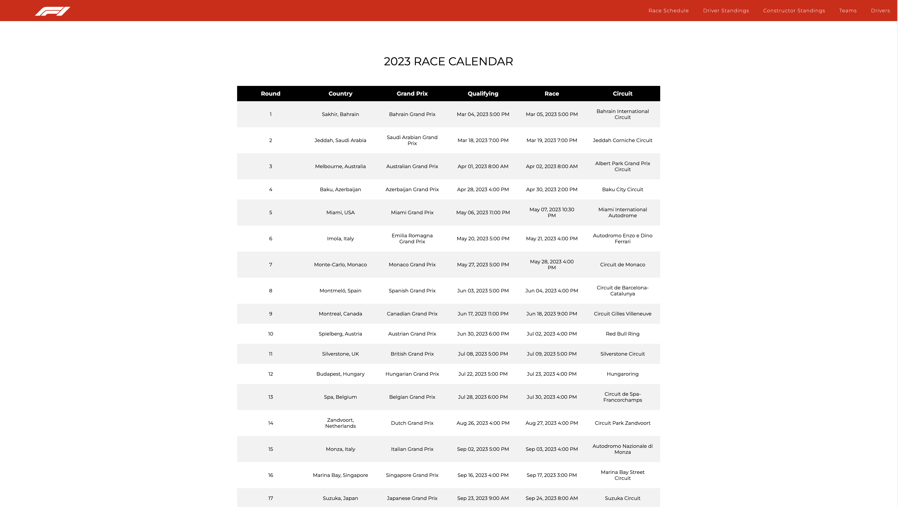
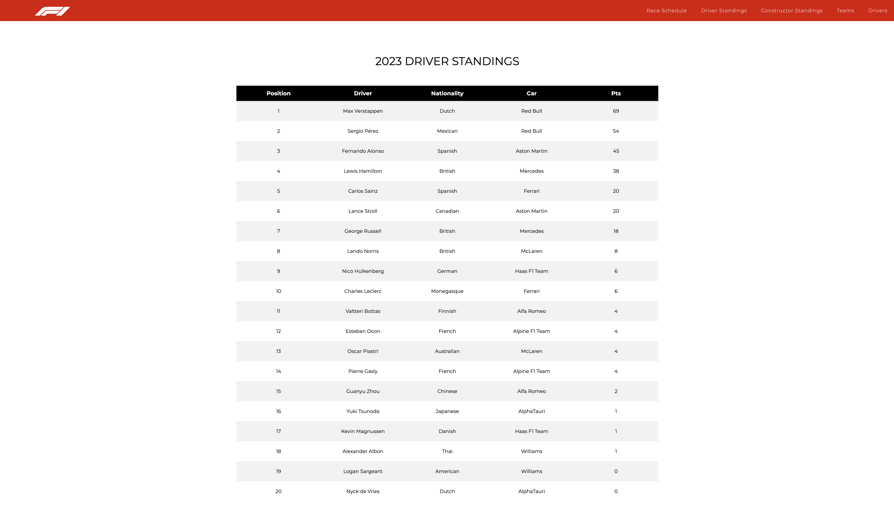
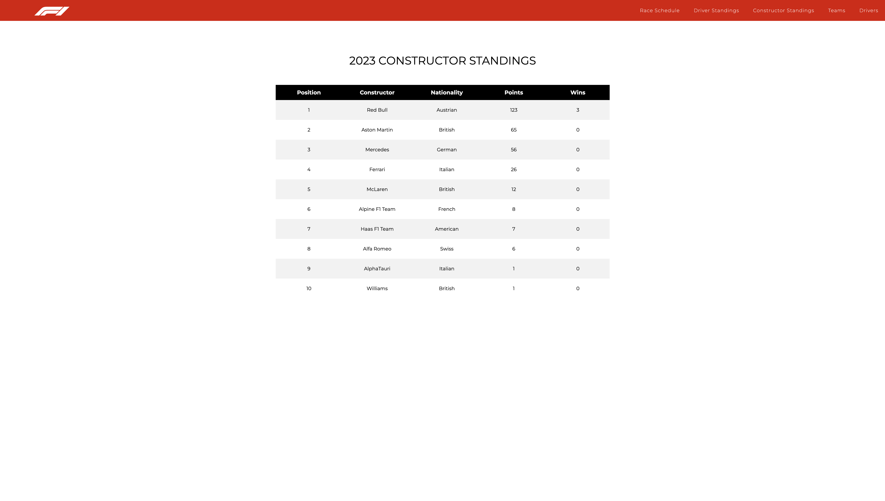
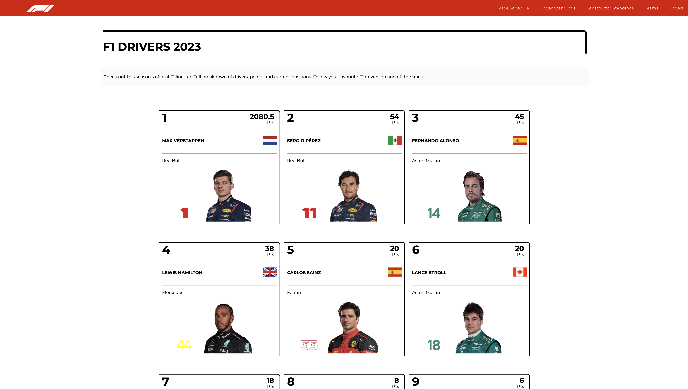
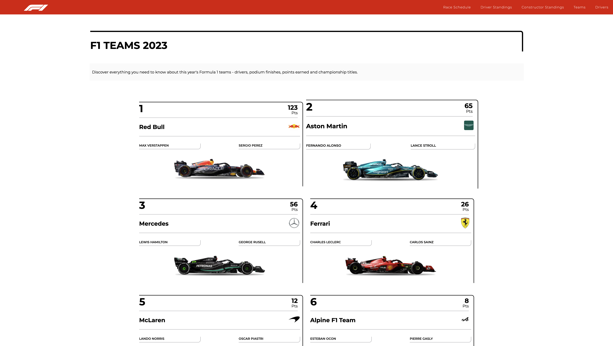
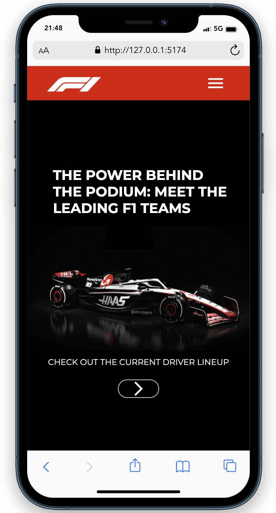
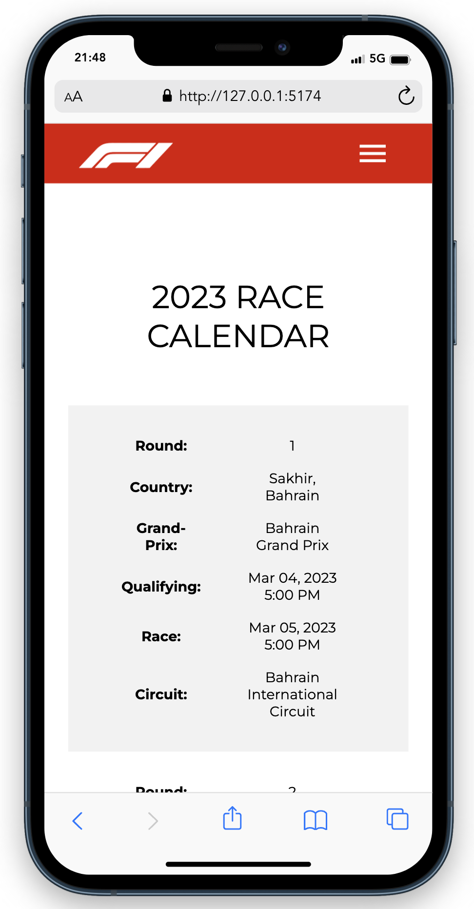
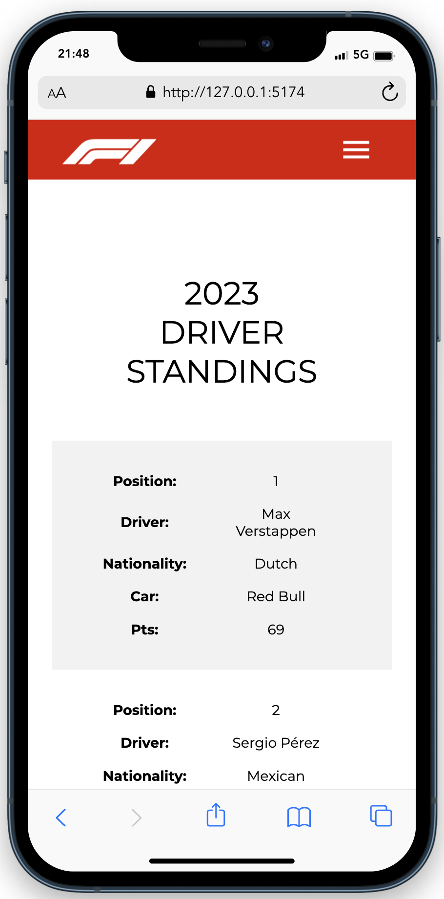
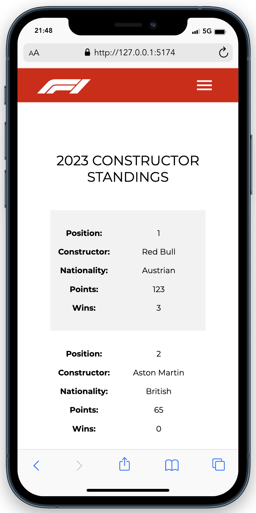
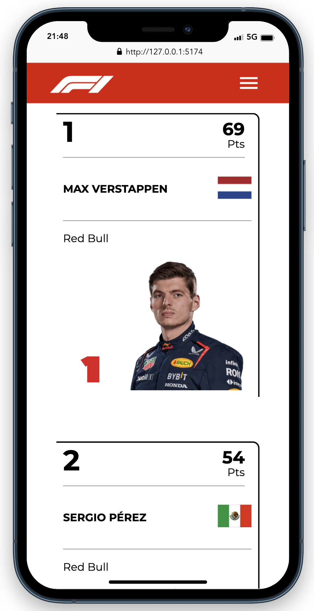
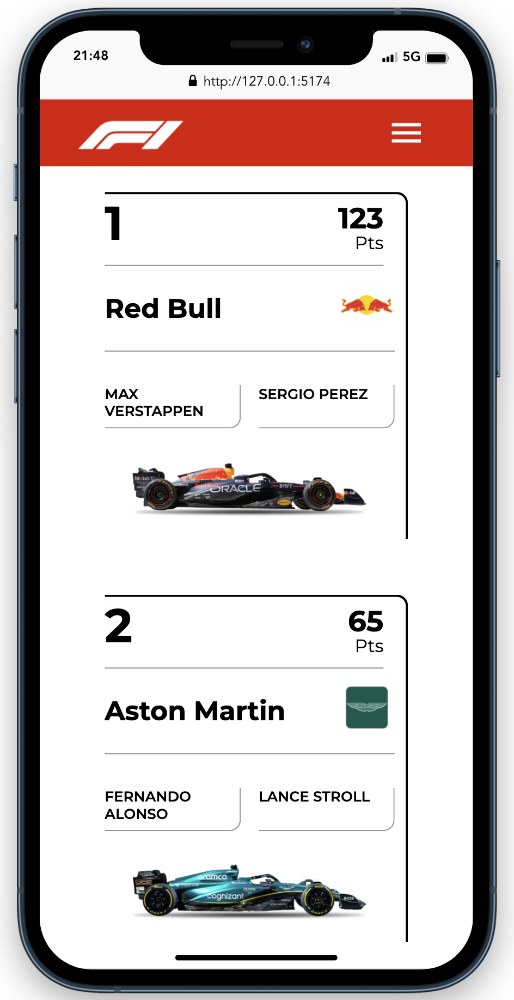

## Credits

- Formula One website for providing valuable information and resources.